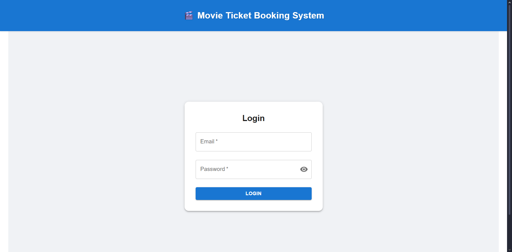
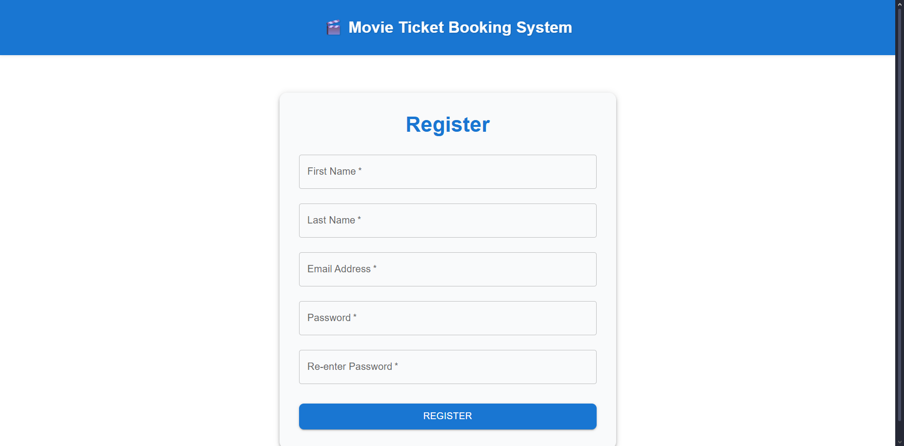
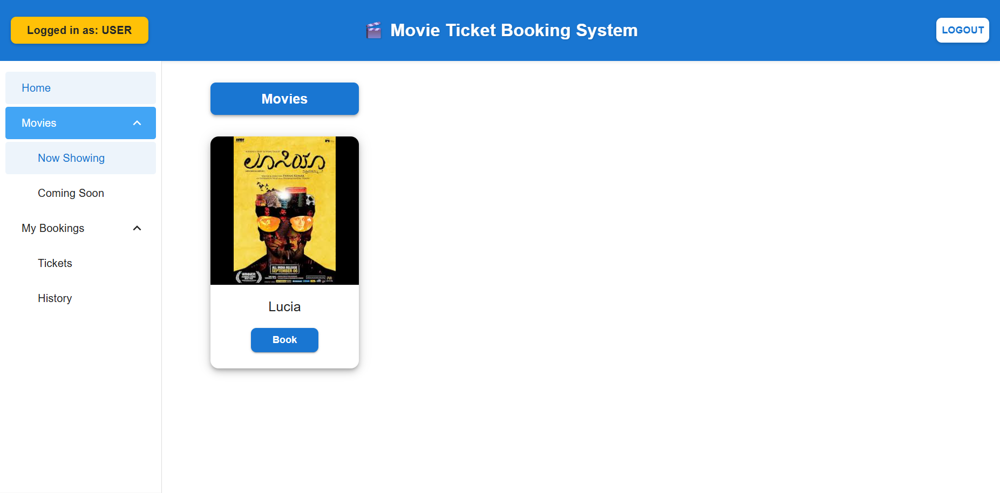
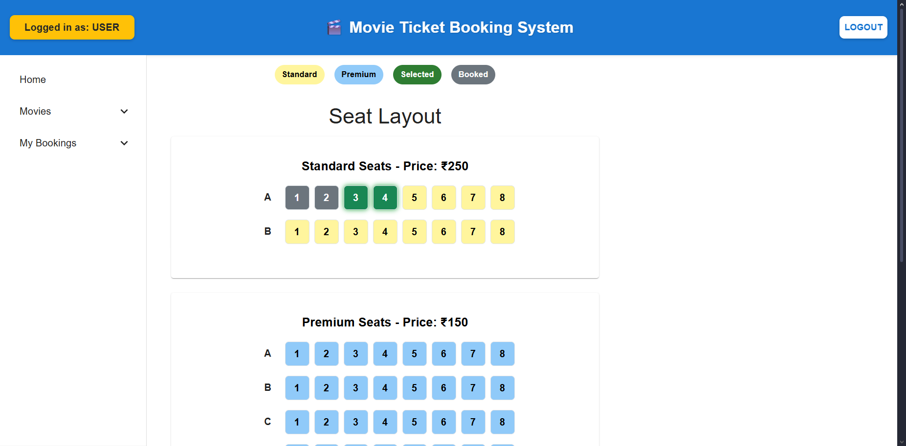
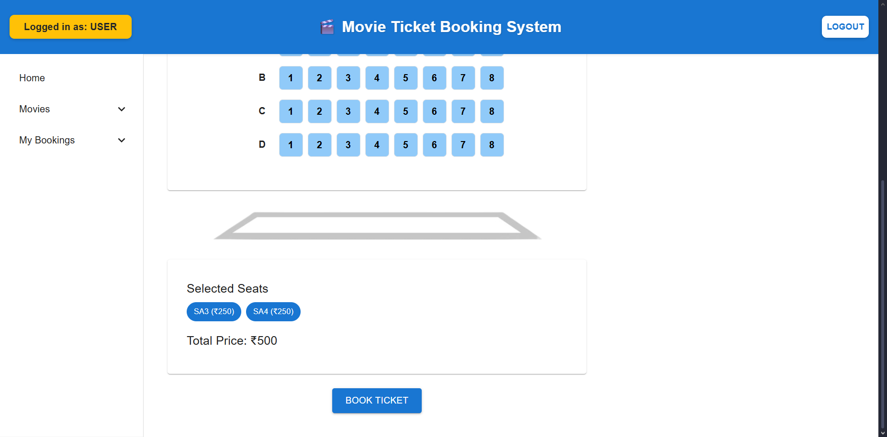
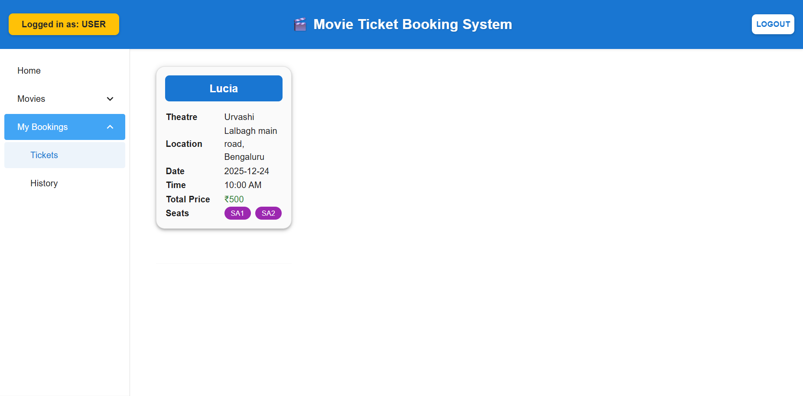

# **Movie Ticket Booking System**

A fullstack web application for booking movie tickets online.

Built with :
    - Spring boot (backend and REST APIs with JWT authentication)
    - React.js (frontend)
    - MySQL (database)

## Features

### Admin Features :
    - Manage movies (add, update, delete)
    - Manage theatres and shows
    - View all bookings

### User Features :
    - Register & login with JWT authentication
    - Browse available movies and theatres
    - View showtimes & seat availability
    - Book tickets with seat selection
    - View booking history


## Tech stack :
### Backend: 
- Spring Boot
- MySQL
- Spring Security
- JPA/Hibernate

### Frontend:
- React
- Material UI (MUI)
- Axios

### Build Tools:
- Gradle
- Vite

### Prerequisites
- Java 17+
- Node.js (for frontend development and build)
- MySQL Server
- Gradle (for backend build)
- npm (for frontend dependencies)
## 📂 Project Structure
```
movie-ticket-booking/
│── backend/               # Spring Boot application
│   ├── src/main/java/...  # Backend code
│   ├── src/main/resources # application.properties
│   └── build.gradle       # Gradle config
│
│── frontend/              # React application
│   ├── public/            # Static assets
│   ├── src/               # React components, pages, services
│   └── package.json       # Dependencies
│
└── README.md

```

## Setup Instructions

### Backend (Spring Boot / Gradle)
1. Navigate to the backend folder:
   ```
   cd backend
   ```

2. Configure the Database

    Edit `src/main/resources/application.properties` and add the following:

    ```properties
    spring.datasource.url=jdbc:mysql://localhost:3306/movie_db
    spring.datasource.username=root
    spring.datasource.password=yourpassword
    spring.jpa.hibernate.ddl-auto=update
    spring.jpa.show-sql=true
    ```

3. Run the backend
    ```
    ./gradlew bootRun
    ```

4. Verify backend
  Open a browser or Postman and check:
    ```
    http://localhost:8080
    ```


### Frontend (React / Vite)

Step 1: Navigate to the frontend folder
  ```
cd frontend
  ```

Step 2: Install dependencies
  ```
npm install
  ```

Step 3: Start the development server
  ```
npm run dev
  ```

Step 4: Verify frontend
  Open a browser and visit:
  ```
    http://localhost:5176
  ```

Step 5 (Optional): Build for production
  ```
npm run build
  ```

- The compiled files will be in the dist/ folder.
- You can serve them via Spring Boot by copying them to:
    backend/src/main/resources/static/

### Database Setup

1. Make sure MySQL is installed and running.

2. Create a new database (example: ecommerce_db):
    ```
    CREATE DATABASE ecommerce_db;
    ```

3. Update your application.properties with your username and password.

4. Tables will be created automatically on first run due to:
   spring.jpa.hibernate.ddl-auto=update


### Screenshots

#### Homepage - Before login

#### Login Page


#### Register Page 


#### Movie List Page


#### Movie Shows Page


#### Seat Layout Page


#### Seat Layout Booking Button Page


### Tickets Booked Page



